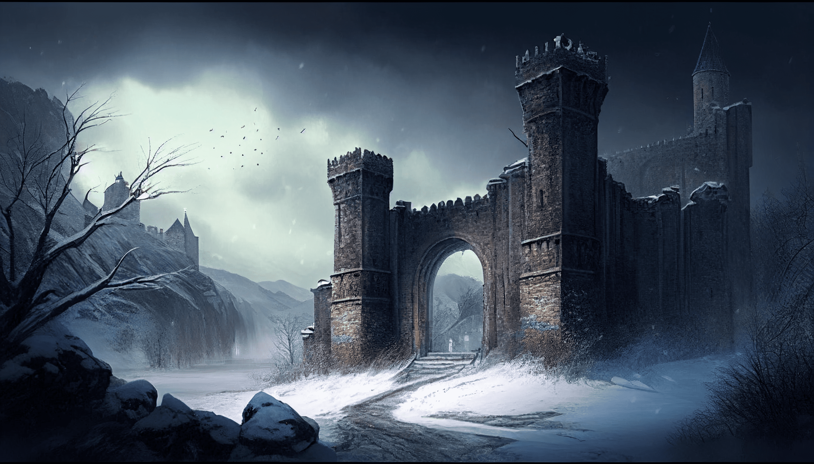

<br/>
<p align="center">
  <a href="https://github.com/Runorre/B-MUL-200-MAR-2-1-myrpg-angelo.anselmet">
    
  </a>

  <h3 align="center">Spring</h3>

  <p align="center">
    my_rpg Epitech project Tek 1
    <br/>
    <br/>
  </p>
</p>


## Table Of Contents

* [About the Project](#about-the-project)
* [Getting Started](#getting-started)
  * [Prerequisites](#prerequisites)
  * [Installation](#installation)
* [Authors](#authors)
* [Acknowledgements](#acknowledgements)

## About The Project



Le royaume était florissant et le roi était aimé de tous. Les habitants y menaient une vie heureuse. Un jour, après une bataille féroce et glorieuse, le roi ouvrit un trésor de guerre. À l'intérieur se trouvait un miroir qui ne sembla pas attirer l'attention du roi. Il leva le miroir pour s'y regarder, mais en voyant son reflet maléfique, il le fit tomber. Le miroir se brisa en mille morceaux, laissant ainsi échapper son âme démoniaque.

Cette âme était froide, dépourvue de vie et animée uniquement par une soif de pouvoir. La famille royale fut expulsée du château après un coup d'État sans difficulté orchestre par ce nouveau démon. C'est ainsi que commença la quête du roi pour reprendre le pouvoir, non seulement pour sa famille, mais aussi pour son royaume, et pour vaincre cette nouvelle menace démoniaque qui menaçait l'équilibre et la paix du royaume.

## Getting Started


### Prerequisites

Vous avez absolument besoins d'avoir la CSFML sur votre ordinateur pour pouvoir jouer à Spring

```sh
brew install csfml
```

### Installation

1. Clone le repo

```sh
git clone git@github.com:EpitechPromo2027/B-MUL-200-MAR-2-1-myrpg-angelo.anselmet.git
```

2. Compilé le repo

```sh
make
```

3. Lancé le jeu !

```sh
./my_rpg
```

## Authors

* **Angelo** - [Runorre](https://github.com/Runorre/) - 
* **Adam** - [dam](https://github.com/AdamBenzidane) -
* **Celestin** - [celestingm](https://github.com/celestingm) -
* **Tom** - [tomclgr](https://github.com/tomclgr) -

## Acknowledgements

* [Arcadius (Doubleur)](https://www.youtube.com/watch?v=dQw4w9WgXcQ&pp=ygUJcmljayByb2xs)
